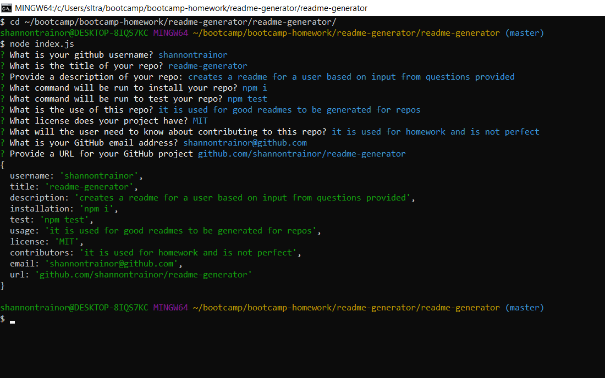

# ReadMe Generator

## Description
AS A developer
I WANT a README generator
SO THAT I can easily put together a good README for a new project

## Usage
This ReadMe Generator was developed to provide a user with a README for their repo. The user will be prompted to answer questions via their terminal. Prompts include questions like: what the title of their project is, what it is used for, how to test it, and contact information. Some questions require input, while others have default answers, or a list for the user to choose from. Once the questions are completed, a README.md file is generated containing the information the user provided. The README Generator was created to practice Node & ES6.

## Deployed Here
Here is a video showing the deployment of the application:
[]

A photo of the terminal producing a README is seen here:

The syntax of the README-generator can be found here:
https://github.com/shannontrainor/readme-generator.git

### Credits
GitHub https://github.com/  
OBS Studio https://obsproject.com/  
Dave's Node Cheatsheet https://unh.bootcampcontent.com/unh-coding-bootcamp/unh-por-fsf-pt-03-2020-u-c/tree/master/00-resources/node-cheatsheet

